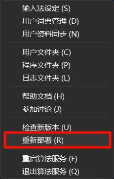

## 预览

### 竖排


### 横排


## 使用

### 1. 编辑 weasel.yaml

在`weasel.yaml`中找到`preset_color_schemes`字段，添加以下内容：

```yaml title='weasel.yaml' ins={2-26}
preset_color_schemes:
  miku:
    name: 初音未来
    author: NorthZeroD
    back_color: 0xAFBBC539
    border_color: 0xFFBBC539
    shadow_color: 0x10BBC539
    text_color: 0xFFA9DEFF
    hilited_text_color: 0xFFA9DEFF
    hilited_back_color: 0x00000000
    hilited_shadow_color: 0x00000000
    nextpage_color: 0xFF6300D1
    prevpage_color: 0xFF6300D1
    hilited_mark_color: 0x00000000
    hilited_label_color: 0xFF6300D1
    hilited_candidate_text_color: 0xFF6300D1
    hilited_comment_text_color: 0x00000000
    hilited_candidate_back_color: 0xAFFFFFFF
    hilited_candidate_border_color: 0xFFBBC539
    hilited_candidate_shadow_color: 0x00000000
    label_color: 0xFFFFFFFF
    candidate_text_color: 0xFFFFFFFF
    comment_text_color: 0x00000000
    candidate_back_color: 0x00000000
    candidate_border_color: 0x00000000
    candidate_shadow_color: 0x00000000
```

### 2. 编辑 weasel.custom.yaml

在`weasel.custom.yaml`中，将`patch`的`style/color_scheme`改成`miku`。

```yaml title='weasel.custom.yaml' 'miku'
customization:
  distribution_code_name: Weasel
  distribution_version: 0.17.4
  generator: "Weasel::UIStyleSettings"
  modified_time: "Thu Oct 23 22:39:49 2025"
  rime_version: 1.13.1
patch:
  "style/color_scheme": miku
```

### 3. 重新部署

最后在系统托盘右键Rime图标，选择`重新部署`。



## 推荐

### 霞鹜文楷

超棒的文楷字体！你现在所看到的这行字便是用的:link[霞鹜文楷]{#lxgw/LxgwWenKai}！

### 万象拼音

不知道选哪个词库？那就快来试试:link[Rime万象拼音输入方案]{#amzxyz/rime_wanxiang}！

真正实现**聪明的输入法懂你心意**！

## 后记

如果喜欢这个主题，就为:link[Rime Miku Theme]{#NorthZeroD/rime-miku-theme}点个⭐吧！

欢迎将主题分享给他人！欢迎在评论区发表你的看法~♥️

(style: width:200px;)
