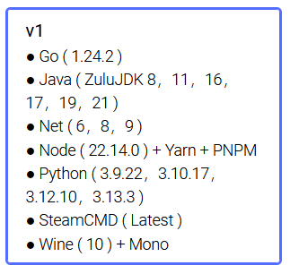
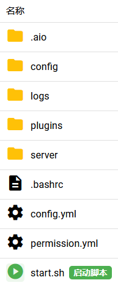
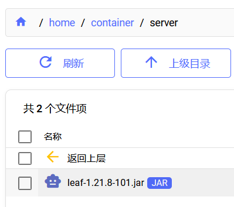

## 介绍

### MCDR 是什么

> MCDReforged (MCDR, 下同) 是一个管理 Minecraft 服务器的工具，拥有自定义插件系统。完全无需修改 Minecraft 服务器本身
>
> 游戏内计算器，玩家高亮，计分板操作，结构文件管理，备份/回档... 你可以用 MCDR 和其插件控制整个 Minecraft 服务器
>
> [*更多...*](https://docs.mcdreforged.com/zh-cn/latest/quick_start/introduction.html)

## 参考文档

> [!note]- 参考
> [**快速上手 — MCDReforged 2.15.1 文档**](https://docs.mcdreforged.com/zh-cn/latest/quick_start/index.html)
>
> [**环境调用方法 - 简幻欢社区文档**](https://www.yuque.com/simpfox/simpdoc/customer-aio-how-to-use-mise)
>
> [**调用信息对应表 - 简幻欢社区文档**](https://www.yuque.com/simpfox/simpdoc/customer-aio-path-list)

## 准备

### 实例选择 

1. 选择镜像类型 **`基础镜像`**
2. 选择实例类别 **`自定义-需有开服经验`**
3. 选择实例服务端 **`AIO`**
4. 选择实例版本 **`v1`**
5. 选择实例规格 **`随意`**

> [!tip]- 图示
> 
> 
> 
> 

### 启动脚本

简幻欢使用`/home/container`目录下的`start.sh`脚本作为启动脚本。当你在实例`终端`处按下`▶️启动`按钮时，服务器将执行启动脚本，即`start.sh`中的所有命令。

> [!note]- 图示
> 

以下是简幻欢初始提供的启动脚本，我们只保留第一行[`#!/bin/bash`](https://cn.linux-console.net/?p=13860)，删去其余内容：

```bash title='start.sh' {1} del={3-9}
#!/bin/bash

maxmem=$((SERVER_MEMORY - 1000))


echo "使用请看文档 https://www.yuque.com/simpfox/simpdoc/customer-startup-helper"
echo "使用请看文档 https://www.yuque.com/simpfox/simpdoc/customer-startup-helper"
echo "使用请看文档 https://www.yuque.com/simpfox/simpdoc/customer-startup-helper"
sleep 5
```

[*关于Shell命令*](https://www.runoob.com/linux/linux-shell.html)

## 安装MCDR

### 使用 pip 安装

在`start.sh`中写入以下内容：

```bash title='start.sh' ins={3,5}
#!/bin/bash

mise use -g python@3.13.3

pip3 install mcdreforged
```

然后运行实例。输出：

```log {1-2,41-43} collapse={3-40,44-46}
mise hint use multiple versions simultaneously with mise use python@3.12 python@3.11
mise ~/.aio/mise/config.toml tools: python@3.13.3
Looking in indexes: https://mirrors.aliyun.com/pypi/simple
Collecting mcdreforged
  Downloading https://mirrors.aliyun.com/pypi/packages/a2/b1/90b8e4de8ab3e873922c8273f74c3d90f45c6b383c4884713f169a4a0f35/mcdreforged-2.15.1-py3-none-any.whl (297 kB)
Collecting colorama>=0.4.4 (from mcdreforged)
  Downloading https://mirrors.aliyun.com/pypi/packages/d1/d6/3965ed04c63042e047cb6a3e6ed1a63a35087b6a609aa3a15ed8ac56c221/colorama-0.4.6-py2.py3-none-any.whl (25 kB)
Collecting colorlog>=6.4 (from mcdreforged)
  Downloading https://mirrors.aliyun.com/pypi/packages/e3/51/9b208e85196941db2f0654ad0357ca6388ab3ed67efdbfc799f35d1f83aa/colorlog-6.9.0-py3-none-any.whl (11 kB)
Collecting packaging>=23.0 (from mcdreforged)
  Downloading https://mirrors.aliyun.com/pypi/packages/20/12/38679034af332785aac8774540895e234f4d07f7545804097de4b666afd8/packaging-25.0-py3-none-any.whl (66 kB)
Collecting parse>=1.18.0 (from mcdreforged)
  Downloading https://mirrors.aliyun.com/pypi/packages/d0/31/ba45bf0b2aa7898d81cbbfac0e88c267befb59ad91a19e36e1bc5578ddb1/parse-1.20.2-py2.py3-none-any.whl (20 kB)
Collecting pathspec (from mcdreforged)
  Downloading https://mirrors.aliyun.com/pypi/packages/cc/20/ff623b09d963f88bfde16306a54e12ee5ea43e9b597108672ff3a408aad6/pathspec-0.12.1-py3-none-any.whl (31 kB)
Collecting prompt-toolkit~=3.0 (from mcdreforged)
  Downloading https://mirrors.aliyun.com/pypi/packages/84/03/0d3ce49e2505ae70cf43bc5bb3033955d2fc9f932163e84dc0779cc47f48/prompt_toolkit-3.0.52-py3-none-any.whl (391 kB)
Collecting psutil>=5.8.0 (from mcdreforged)
  Downloading https://mirrors.aliyun.com/pypi/packages/bf/b9/b0eb3f3cbcb734d930fdf839431606844a825b23eaf9a6ab371edac8162c/psutil-7.0.0-cp36-abi3-manylinux_2_12_x86_64.manylinux2010_x86_64.manylinux_2_17_x86_64.manylinux2014_x86_64.whl (277 kB)
Collecting requests>=2.26 (from mcdreforged)
  Downloading https://mirrors.aliyun.com/pypi/packages/1e/db/4254e3eabe8020b458f1a747140d32277ec7a271daf1d235b70dc0b4e6e3/requests-2.32.5-py3-none-any.whl (64 kB)
Collecting resolvelib (from mcdreforged)
  Downloading https://mirrors.aliyun.com/pypi/packages/c7/dd/a7bd1227a77403d894ac6c71bf55f6aff39cb485b268d285a158209d5963/resolvelib-1.2.0-py3-none-any.whl (18 kB)
Collecting ruamel.yaml~=0.17 (from mcdreforged)
  Downloading https://mirrors.aliyun.com/pypi/packages/d1/e5/f2a0621f1781b76a38194acae72f01e37b1941470407345b6e8653ad7640/ruamel.yaml-0.18.15-py3-none-any.whl (119 kB)
Collecting typing-extensions>=4.6.0 (from mcdreforged)
  Downloading https://mirrors.aliyun.com/pypi/packages/18/67/36e9267722cc04a6b9f15c7f3441c2363321a3ea07da7ae0c0707beb2a9c/typing_extensions-4.15.0-py3-none-any.whl (44 kB)
Collecting wcwidth (from mcdreforged)
  Downloading https://mirrors.aliyun.com/pypi/packages/fd/84/fd2ba7aafacbad3c4201d395674fc6348826569da3c0937e75505ead3528/wcwidth-0.2.13-py2.py3-none-any.whl (34 kB)
Collecting charset_normalizer<4,>=2 (from requests>=2.26->mcdreforged)
  Downloading https://mirrors.aliyun.com/pypi/packages/7e/95/42aa2156235cbc8fa61208aded06ef46111c4d3f0de233107b3f38631803/charset_normalizer-3.4.3-cp313-cp313-manylinux2014_x86_64.manylinux_2_17_x86_64.manylinux_2_28_x86_64.whl (151 kB)
Collecting idna<4,>=2.5 (from requests>=2.26->mcdreforged)
  Downloading https://mirrors.aliyun.com/pypi/packages/76/c6/c88e154df9c4e1a2a66ccf0005a88dfb2650c1dffb6f5ce603dfbd452ce3/idna-3.10-py3-none-any.whl (70 kB)
Collecting urllib3<3,>=1.21.1 (from requests>=2.26->mcdreforged)
  Downloading https://mirrors.aliyun.com/pypi/packages/a7/c2/fe1e52489ae3122415c51f387e221dd0773709bad6c6cdaa599e8a2c5185/urllib3-2.5.0-py3-none-any.whl (129 kB)
Collecting certifi>=2017.4.17 (from requests>=2.26->mcdreforged)
  Downloading https://mirrors.aliyun.com/pypi/packages/e5/48/1549795ba7742c948d2ad169c1c8cdbae65bc450d6cd753d124b17c8cd32/certifi-2025.8.3-py3-none-any.whl (161 kB)
Collecting ruamel.yaml.clib>=0.2.7 (from ruamel.yaml~=0.17->mcdreforged)
  Downloading https://mirrors.aliyun.com/pypi/packages/1f/8f/ecfbe2123ade605c49ef769788f79c38ddb1c8fa81e01f4dbf5cf1a44b16/ruamel.yaml.clib-0.2.12-cp313-cp313-manylinux_2_17_x86_64.manylinux2014_x86_64.whl (745 kB)
     ━━━━━━━━━━━━━━━━━━━━━━━━━━━━━━━━━━━━━━ 745.1/745.1 kB 23.0 MB/s eta 0:00:00
Installing collected packages: wcwidth, parse, urllib3, typing-extensions, ruamel.yaml.clib, resolvelib, psutil, prompt-toolkit, pathspec, packaging, idna, colorlog, colorama, charset_normalizer, certifi, ruamel.yaml, requests, mcdreforged
Successfully installed certifi-2025.8.3 charset_normalizer-3.4.3 colorama-0.4.6 colorlog-6.9.0 idna-3.10 mcdreforged-2.15.1 packaging-25.0 parse-1.20.2 pathspec-0.12.1 prompt-toolkit-3.0.52 psutil-7.0.0 requests-2.32.5 resolvelib-1.2.0 ruamel.yaml-0.18.15 ruamel.yaml.clib-0.2.12 typing-extensions-4.15.0 urllib3-2.5.0 wcwidth-0.2.13
WARNING: Running pip as the 'root' user can result in broken permissions and conflicting behaviour with the system package manager, possibly rendering your system unusable.It is recommended to use a virtual environment instead: https://pip.pypa.io/warnings/venv. Use the --root-user-action option if you know what you are doing and want to suppress this warning.

[notice] A new release of pip is available: 24.3.1 -> 25.2
[notice] To update, run: pip install --upgrade pip
```

> [!tip] 我们做了什么？
> 我们利用[`mise`](https://mise.jdx.dev/)，全局使用了`Python 3.13.3`，然后使用[`pip3`](https://www.runoob.com/w3cnote/python-pip-install-usage.html)命令安装了`mcdreforged`。

> [!note]- 关于WARNING
> 不必理会。如果你想深究，见：
>
> [Why do I still get a warning about "Running pip as the 'root' user" inside a Docker container?](https://stackoverflow.com/questions/68673221/why-do-i-still-get-a-warning-about-running-pip-as-the-root-user-inside-a-doc)

### 验证安装

在`start.sh`中，注释掉之前安装所用的命令，增加`mcdreforged`命令：

```bash title='start.sh' {3,5} ins={7}
#!/bin/bash

# mise use -g python@3.13.3

# pip3 install mcdreforged

mcdreforged
```

然后运行实例。输出：

```log
MCDReforged 2.15.1 is starting up
MCDReforged is open source, u can find it here: https://github.com/MCDReforged/MCDReforged
[MCDR] [17:24:23] [MainThread/ERROR]: Configuration file 'config.yml' is missing
[MCDR] [17:24:23] [MainThread/INFO]: Looks like MCDR is not initialized at current directory /home/container
[MCDR] [17:24:23] [MainThread/INFO]: Use command "mcdreforged init" to initialize MCDR first
[MCDR] [17:24:23] [MainThread/INFO]: See document https://docs.mcdreforged.com/en/latest/quick_start.html#start-up
```

这证明我们已经成功安装了MCDR。

### 初始化MCDR

在`start.sh`中，为`mcdreforged`命令增加`init`参数：

```bash title='start.sh' ins='init'
#!/bin/bash

# mise use -g python@3.13.3

# pip3 install mcdreforged

mcdreforged init
```

然后运行实例。输出：

```log
Initialized environment for MCDReforged in /home/container
```

这表明我们已经成功将MCDR初始化到目录`/home/container`，即`start.sh`所在位置。

在实例`文件`管理处，你能看到如下MCDR结构：

```txt
/home/container/
├── config/
├── logs/
├── plugins/
├── server/
├── config.yml
├── permission.yml
└── ...
```

> [!note]- 图示
> 

**做得好！我们已经成功安装并初始化了MCDR🎉**

## 安装MC服务端

> 要用 MCDR 管理 Minecraft 服务器，你首先需要**准备并配置**好一个 Minecraft 服务端。
>
> 例如，这是典型的原版 Minecraft 服务端目录结构：

```txt
./
├── libraries/
├── logs/
├── versions/
├── world/
├── banned-ips.json
├── banned-players.json
├── eula.txt
├── ops.json
├── minecraft_server.jar
├── server.properties
├── usercache.json
└── whitelist.json
```

> [!tip] 已经准备好服务端了？
> 直接将服务端**所有文件**上传到MCDR的`server`目录！
> 
> 然后跳到[配置MCDR](#配置mcdr)章节。
> > [!note]- 图示
> > 

> [!note] 注
> 篇幅有限，仅演示[Leaf](https://www.leafmc.one/download)服务端的部署流程。
> 
> 这些步骤同样适用于其他[**插件服务端**](https://nitwikit.8aka.org/Java/start/server-core-choose/plugin)，如[Paper](https://papermc.io/downloads/paper), [Purpur](https://purpurmc.org/download/purpur)。

### 上传核心

挑选你喜欢的服务端，从其官网下载服务端核心：

- [Leaf](https://www.leafmc.one/download) *推荐([为什么?](https://www.leafmc.one/zh/docs/benchmark/entity-performance))*
- [Purpur]((https://purpurmc.org/download/purpur))
- [Paper]((https://papermc.io/downloads/paper))
- [Leaves](https://leavesmc.org/downloads/leaves)

[*不知道怎么选？看这里...*](https://nitwikit.8aka.org/Java/start/server-core-choose/plugin)

将下载好的服务端核心上传到MCDR的`server`目录。

> [!tip]- 图示
> 

### 启动命令

在`start.sh`中，将`mcdreforged init`命令注释掉，添加新的命令：

```bash title='start.sh' {7} ins={9,10} collapse={3-5} '${openjdk21}' '-Xmx15G' '-Xms15G' 'leaf-1.21.8-101.jar'
#!/bin/bash

# mise use -g python@3.13.3

# pip3 install mcdreforged

# mcdreforged init

cd server
${openjdk21} -Xms15G -Xmx15G -jar leaf-1.21.8-101.jar --nogui
```

> [!warning] 注意
> `leaf-1.21.8-101.jar`是我所用服务端核心的名称，应当**换成你上传的核心名称**。
>
> `-Xmx`用来指定服务器最**大**内存，其后接内存大小(带单位)。建议设置为你的实例**可用内存大小减1G**。
>
> `-Xms`用来指定服务器最**小**内存，可与`-Xmx`设定的大小相同。
>
> `${openjdk21}`是用来启动服务端的java程序，它被定义在环境变量中。可用值见[调用信息对应表](https://www.yuque.com/simpfox/simpdoc/customer-aio-path-list#ZjNr3)。
>
> 有关不同MC版本使用的java版本，见[各Minecraft常见版本所需Java版本及其常见答疑（尽量长期维护）](https://www.bilibili.com/opus/939387567592177669)。

> [!tip]- 我们做了什么？
> 当我们启动实例，即运行`start.sh`时，我们的工作目录在`/home/container`中，也就是`start.sh`所处位置。
>
> 显然，我们的服务端核心文件不在这里，而是在`/home/container/server`目录中。因此，我们需要使用[`cd`](https://www.runoob.com/linux/linux-comm-cd.html)命令将工作目录切换到`server`目录。
>
> 接下来，我们调用环境变量`openjdk21`所指向的`java`程序，创建[JVM(Java Virtual Machine，Java虚拟机)](https://javaguide.cn/java/jvm/jvm-intro.html)，MC服务端程序将在JVM上运行；
>
> 参数[`-Xms`](https://docs.oracle.com/en/java/javase/21/docs/specs/man/java.html#extra-options-for-java)传递给`JVM`，指定堆内存的最小大小和初始大小为`15G`；
>
> 参数[`-Xmx`](https://docs.oracle.com/en/java/javase/21/docs/specs/man/java.html#extra-options-for-java)传递给`JVM`，指定堆内存的最大大小为`15G`；
>
> 参数[`-jar`](https://docs.oracle.com/en/java/javase/21/docs/specs/man/java.html#synopsis)传递给`JVM`，指定运行我们的服务端程序`leaf-1.21.8-101.jar`；
>
> 参数[`--nogui`](https://zh.minecraft.wiki/w/Tutorial:%E6%9E%B6%E8%AE%BEJava%E7%89%88%E6%9C%8D%E5%8A%A1%E5%99%A8#Minecraft%E9%80%89%E9%A1%B9)传递给`MC服务端`，指定启动服务端时不显示图形界面。
>
> > [`nogui`与`--nogui`的作用相同，主要用于向后兼容非常旧的服务器版本，但更加推荐使用`--nogui`，因为它的格式与其他选项更一致。](https://zh.minecraft.wiki/w/Tutorial:%E6%9E%B6%E8%AE%BEJava%E7%89%88%E6%9C%8D%E5%8A%A1%E5%99%A8#Minecraft%E9%80%89%E9%A1%B9)

然后运行实例，输出：

```log {12,13}
Picked up _JAVA_OPTIONS: -Djava.util.prefs.userRoot=/home/container/.aio/.userPrefs -Djava.util.prefs.systemRoot=/home/container/.aio/.systemPrefs
Downloading mojang_1.21.8.jar
Applying patches
Starting org.bukkit.craftbukkit.Main
[21:50:29 INFO]: [bootstrap] Running Java 21 (OpenJDK 64-Bit Server VM 21.0.7+6-LTS; Azul Systems, Inc. Zulu21.42+19-CA) on Linux 6.1.0-21-amd64 (amd64)
[21:50:29 INFO]: [bootstrap] Loading Leaf 1.21.8-101-ver/1.21.8@6933848 (2025-09-06T06:38:44Z) for Minecraft 1.21.8
[21:50:30 INFO]: [LeafConfig] Loading config...
[21:50:30 INFO]: [LeafConfig] Successfully loaded config in 316ms.
[21:50:30 INFO]: [PluginInitializerManager] Initializing plugins...
[21:50:30 INFO]: [PluginInitializerManager] Initialized 0 plugins
[21:50:32 INFO]: [ReobfServer] Remapping server...
[21:50:39 WARN]: Failed to load eula.txt
[21:50:39 INFO]: You need to agree to the EULA in order to run the server. Go to eula.txt for more info.
[21:50:42 INFO]: [ReobfServer] Done remapping server in 10324ms.
```

看到这两句：

```log
Failed to load eula.txt
You need to agree to the EULA in order to run the server. Go to eula.txt for more info.
```

这表明我们的服务端安装很成功。

接下来照其所言，你需要同意并签署[Minecraft最终用户许可协议](https://www.minecraft.net/zh-hans/eula)才能运行此服务器。

### 签署EULA

> [!warning] 提醒
> **确保您已认真阅读并充分理解[Minecraft最终用户许可协议](https://www.minecraft.net/zh-hans/eula)。**
>
> **签署EULA后，您将负法律责任。**

在服务端核心目录，即`server`目录中，找到`eula.txt`。

编辑其内容，将`eula`字段的值改为`true`：

```toml title='eula.txt' ins='true'
#By changing the setting below to TRUE you are indicating your agreement to our EULA (https://aka.ms/MinecraftEULA).
#Sat Sep 06 21:50:39 CST 2025
eula=true
```

### 配置端口

在服务端核心目录，即`server`目录中，找到`server.properties`。

编辑其内容，将以下字段的值改为你的实例端口号：

```toml title='server.properties' {44,56} collapse={1-43,45-55,57-65} ins='20814'
#Minecraft server properties
#Sun Sep 07 02:31:21 CST 2025
accepts-transfers=false
allow-flight=false
allow-nether=true
broadcast-console-to-ops=true
broadcast-rcon-to-ops=true
bug-report-link=
debug=false
difficulty=easy
enable-command-block=false
enable-jmx-monitoring=false
enable-query=false
enable-rcon=false
enable-status=true
enforce-secure-profile=true
enforce-whitelist=false
entity-broadcast-range-percentage=100
force-gamemode=false
function-permission-level=2
gamemode=survival
generate-structures=true
generator-settings={}
hardcore=false
hide-online-players=false
initial-disabled-packs=
initial-enabled-packs=vanilla
level-name=world
level-seed=
level-type=minecraft\:normal
log-ips=true
max-chained-neighbor-updates=1000000
max-players=20
max-tick-time=60000
max-world-size=29999984
motd=A Minecraft Server
network-compression-threshold=256
online-mode=true
op-permission-level=4
pause-when-empty-seconds=-1
player-idle-timeout=0
prevent-proxy-connections=false
pvp=true
query.port=20814
rate-limit=0
rcon.password=
rcon.port=25575
region-file-compression=deflate
require-resource-pack=false
resource-pack=
resource-pack-id=
resource-pack-prompt=
resource-pack-sha1=
server-ip=
server-name=Unknown Server
server-port=20814
simulation-distance=10
spawn-monsters=true
spawn-protection=16
sync-chunk-writes=true
text-filtering-config=
text-filtering-version=0
use-native-transport=true
view-distance=10
white-list=false
```

> [!tip]- 实例端口号是什么？
> 

**好样的！MC服务端已经安装成功🎉**

## 配置MCDR

> MCDR 的配置文件是 config.yml。它位于 MCDR 的工作目录中。

本教程中，`config.yml`与`start.sh`在同个目录，即`/home/container`中。

> [!tip]- 图示
> 

> 在启动时，MCDR 将尝试加载配置文件，并将缺失的选项(如果有)添加到你的配置文件末尾。如果配置文件不存在，MCDR 则将生成默认配置文件并退出。
>
> 配置文件使用 YAML 格式。
>
> 当 MCDR 运行时，你可以使用 !!MCDR reload config 命令(或其缩写 !!MCDR r cfg)来重载配置文件。

> [!note] 注
> 本教程仅介绍必要配置。完整配置说明见[配置 — MCDReforged 2.15.1 文档](https://docs.mcdreforged.com/zh-cn/latest/configuration.html)。

### language

> MCDR 用于输出信息的语言。
>
> [*更多...*](https://docs.mcdreforged.com/zh-cn/latest/configuration.html#language)

将`language`字段的值更改为`zh_cn`以使用简体中文作为MCDR的输出信息的语言。

```yaml title='config.yml' ins=/zh_cn$/
# The language that MCDR will use to display information
# Examples: "en_us", "zh_cn", "zh_tw"
language: zh_cn
```

### start_command

> 启动服务端的控制台命令。它可以是一个字符串，或一个字符串列表。
>
> [*更多...*](https://docs.mcdreforged.com/zh-cn/latest/configuration.html#start-command)

将`start_command`字段的值更改为[启动命令](#启动命令)章节中所使用的命令。

```yaml title='config.yml' ins='${openjdk21} -Xms15G -Xmx15G -jar leaf-1.21.8-101.jar --nogui'
# The command to start the server, it can be a string or a list of string
# (shell mode) If it's a string, the command will be executed as a shell command in a shell environment
# (exec mode) If it's a list of strings, the command will be executed directly
# Example command for starting a Minecraft server:
#   'java -Xms1G -Xmx2G -jar minecraft_server.jar nogui'                        (shell mode)
#   ['java', '-Xms1G', '-Xmx2G', '-jar', 'minecraft_server.jar', 'nogui']       (exec mode)
start_command: ${openjdk21} -Xms15G -Xmx15G -jar leaf-1.21.8-101.jar --nogui
```

### handler

> 不同服务端有着截然不同的输出和命令。服务端处理器是用于在各种服务端之间进行处理的模块，也是 MCDR 控制服务端的接入点。
>
> 处理器确定解析服务端标准输出文本的特定方法，并使用正确的命令控制服务端。
>
> [*更多...*](https://docs.mcdreforged.com/zh-cn/latest/configuration.html#handler)

将`handler`字段的值更改为符合你服务端种类的处理器。

本教程中，使用Leaf服务端，是Paper下游分支，故使用`bukkit_handler`。

```yaml title='config.yml' ins=/bukkit_handler$/
# The handler to the specific way to parse the standard output text of the server and the correct command for server control
#   vanilla_handler    , for Vanilla / Carpet / Fabric server
#   beta18_handler     , for Vanilla server in legacy versions, e.g. < 1.7, or even beta1.8
#   bukkit_handler     , for Bukkit / Spigot server with Minecraft version below 1.14, and Paper / Mohist / Folia server in all version
#   bukkit14_handler   , for Bukkit / Spigot server with Minecraft version 1.14 and above
#   forge_handler      , for Forge server
#   cat_server_handler , for CatServer server
#   arclight_handler   , for Arclight server
#   bungeecord_handler , for Bungeecord server
#   waterfall_handler  , for Waterfall server
#   velocity_handler   , for Velocity server
handler: bukkit_handler
```

> [!tip]- 内置的处理器及其适用的服务端
> |处理器              |兼容的服务端类型
> |-------------------|--------------------------------------------------------------------------------------------------------------------------
> |vanilla_handler    | 用于 原版 / Carpet / Fabric 服务端。只要服务端足够原版就行
> |beta18_handler     | 用于低版本的原版服务端，如 MC < 1.7 的低版本，甚至到 beta1.8 版本。只在 1.6.4 和 beta 1.8.1 版本中进行了测试
> |bukkit_handler     | 用于 1.14 版本以下的 Bukkit / Spigot 服务端，以及所有版本的 Paper / [Mohistmc](https://mohistmc.com/) 服务端
> |bukkit14_handler   | 用于 1.14 或以上版本的 Bukkit / Spigot 服务端
> |forge_handler      | 用于 Forge 服务端
> |cat_server_handler | 适用于 [CatServer](https://github.com/Luohuayu/CatServer) 服务端
> |arclight_handler   | 适用于 [Arclight](https://github.com/IzzelAliz/Arclight) 服务端
> |bungeecord_handler | 用于 BungeeCord 服务端。请在启动命令的 `-jar` 参数之前添加 `-Djline.terminal=jline.UnsupportedTerminal` 参数以支持 MCDR。详见 [此处](https://www.spigotmc.org/wiki/start-up-parameters/)
> |waterfall_handler  | 用于 WaterFall 服务端
> |velocity_handler   | 用于 Velocity 服务端
> |basic_handler      | 不进行任何分析并返回原始文本的处理器。除非你想使用 MCDR 启动非 Minecraft 相关的服务端，否则无需使用

**恭喜！你完成了MCDR的配置🎉**

## 启动

### 命令

在`start.sh`中，将之前所用的命令全部注释掉，添加新的命令：

```bash title='start.sh' {3-10} ins={12}
#!/bin/bash

# mise use -g python@3.13.3

# pip3 install mcdreforged

# mcdreforged init

# cd server
# ${openjdk21} -Xms15G -Xmx15G -jar leaf-1.21.8-101.jar --nogui

mcdreforged
```
然后运行实例，输出：

```log {65} collapse={17-62}
MCDReforged 2.15.1 is starting up
MCDReforged is open source, u can find it here: https://github.com/MCDReforged/MCDReforged
[MCDR] [02:31:11] [MainThread/INFO]: 语言已设置为 zh_cn
[MCDR] [02:31:11] [MainThread/INFO]: 编码 / 解码方式已设置为 utf8 / utf8
[MCDR] [02:31:11] [MainThread/INFO]: 解析处理器已设置为 bukkit_handler
[MCDR] [02:31:11] [MainThread/INFO]: 插件文件夹列表:
[MCDR] [02:31:11] [MainThread/INFO]: - plugins
[MCDR] [02:31:11] [MainThread/INFO]: MCDReforged 2.15.1 正在启动
[MCDR] [02:31:11] [MainThread/INFO]: MCDReforged 正于 Python 3.13.3 环境中运行
[MCDR] [02:31:11] [TaskExecutor/INFO]: 刷新所有插件中
[MCDR] [02:31:11] [TaskExecutor/INFO]: 没有插件变更; 已加载插件数: 2
[MCDR] [02:31:11] [MainThread/INFO]: 正在启动服务端，启动参数为 '${openjdk21} -Xms15G -Xmx15G -jar leaf-1.21.8-101.jar --nogui'
[MCDR] [02:31:11] [MainThread/INFO]: 服务端正在以 PID 32 运行中
[Server] Picked up _JAVA_OPTIONS: -Djava.util.prefs.userRoot=/home/container/.aio/.userPrefs -Djava.util.prefs.systemRoot=/home/container/.aio/.systemPrefs
[MCDR] [02:31:12] [CheckUpdate/INFO]: MCDR 已为最新版
[Server] Starting org.bukkit.craftbukkit.Main
WARNING: your terminal doesn't support cursor position requests (CPR).
[Server] 2025-09-06T18:31:14.218113982Z ServerMain WARN Advanced terminal features are not available in this environment
[Server] [02:31:14 INFO]: [bootstrap] Running Java 21 (OpenJDK 64-Bit Server VM 21.0.7+6-LTS; Azul Systems, Inc. Zulu21.42+19-CA) on Linux 6.1.0-21-amd64 (amd64)
[Server] [02:31:14 INFO]: [bootstrap] Loading Leaf 1.21.8-101-ver/1.21.8@6933848 (2025-09-06T06:38:44Z) for Minecraft 1.21.8
[Server] [02:31:15 INFO]: [LeafConfig] Loading config...
[Server] [02:31:15 INFO]: [LeafConfig] Successfully loaded config in 233ms.
[Server] [02:31:15 INFO]: [PluginInitializerManager] Initializing plugins...
[Server] [02:31:15 INFO]: [PluginInitializerManager] Initialized 0 plugins
[Server] [02:31:21 INFO]: Environment: Environment[sessionHost=https://sessionserver.mojang.com, servicesHost=https://api.minecraftservices.com, name=PROD]
[Server] [02:31:24 INFO]: Loaded 1407 recipes
[Server] [02:31:24 INFO]: Loaded 1520 advancements
[Server] [02:31:24 INFO]: [ca.spottedleaf.dataconverter.minecraft.datatypes.MCTypeRegistry] Initialising converters for DataConverter...
[Server] [02:31:25 INFO]: [ca.spottedleaf.dataconverter.minecraft.datatypes.MCTypeRegistry] Finished initialising converters for DataConverter in 554.1ms
[Server] [02:31:25 INFO]: Starting minecraft server version 1.21.8
[Server] [02:31:25 WARN]: ****************************
[Server] [02:31:25 WARN]: YOU ARE RUNNING THIS SERVER AS AN ADMINISTRATIVE OR ROOT USER. THIS IS NOT ADVISED.
[Server] [02:31:25 WARN]: YOU ARE OPENING YOURSELF UP TO POTENTIAL RISKS WHEN DOING THIS.
[Server] [02:31:25 WARN]: FOR MORE INFORMATION, SEE https://madelinemiller.dev/blog/root-minecraft-server/
[Server] [02:31:25 WARN]: ****************************
[Server] [02:31:25 INFO]: Loading properties
[Server] [02:31:25 INFO]: This server is running Leaf version 1.21.8-101-ver/1.21.8@6933848 (2025-09-06T06:38:44Z) (Implementing API version 1.21.8-R0.1-SNAPSHOT)
[Server] [02:31:25 INFO]: [spark] This server bundles the spark profiler. For more information please visit https://docs.papermc.io/paper/profiling
[Server] [02:31:25 INFO]: Server Ping Player Sample Count: 12
[Server] [02:31:25 INFO]: Using 4 threads for Netty based IO
[Server] [02:31:26 INFO]: [MoonriseCommon] Paper is using 1 worker threads, 1 I/O threads
[Server] [02:31:26 INFO]: [ChunkTaskScheduler] Chunk system is using population gen parallelism: true
[Server] [02:31:27 INFO]: Default game type: SURVIVAL
[Server] [02:31:27 INFO]: Generating keypair
[Server] [02:31:27 INFO]: Starting Minecraft server on *:20814
[Server] [02:31:27 INFO]: Using epoll channel type
[Server] [02:31:27 INFO]: Paper: Using libdeflate (Linux x86_64) compression from Velocity.
[Server] [02:31:27 INFO]: Paper: Using OpenSSL 3.x.x (Linux x86_64) cipher from Velocity.
[Server] [02:31:27 INFO]: Server permissions file permissions.yml is empty, ignoring it
[Server] [02:31:27 INFO]: Preparing level "world"
[Server] [02:31:28 INFO]: Preparing start region for dimension minecraft:overworld
[Server] [02:31:28 INFO]: Preparing spawn area: 0%
[Server] [02:31:29 INFO]: Preparing spawn area: 2%
[Server] [02:31:29 INFO]: Preparing spawn area: 2%
[Server] [02:31:29 INFO]: Time elapsed: 1160 ms
[Server] [02:31:29 INFO]: Preparing start region for dimension minecraft:the_nether
[Server] [02:31:29 INFO]: Preparing spawn area: 0%
[Server] [02:31:29 INFO]: Time elapsed: 203 ms
[Server] [02:31:29 INFO]: Preparing start region for dimension minecraft:the_end
[Server] [02:31:29 INFO]: Preparing spawn area: 0%
[Server] [02:31:30 INFO]: Time elapsed: 149 ms
[Server] [02:31:30 INFO]: [spark] Starting background profiler...
[Server] [02:31:30 INFO]: Done preparing level "world" (3.065s)
[Server] [02:31:30 INFO]: Running delayed init tasks
[Server] [02:31:30 INFO]: Done (17.474s)! For help, type "help"
```

看到这一句：

```log
Done (17.474s)! For help, type "help"
```

这表明你的服务器顺利开起来了！

### 验证MCDR

在MC多人游戏板块，使用`play.simpfun.cn:你的实例端口`作为地址加入服务器。

> [!tip]- 图示
> 
> 

进入游戏后，在聊天栏输入命令并回车：

```txt
!!MCDR
```

输出以下内容：


**大功告成！你成功部署了基于MCDR的Minecraft服务器！恭喜恭喜！🎉🎉🎉**

**\\(^o^)/**
